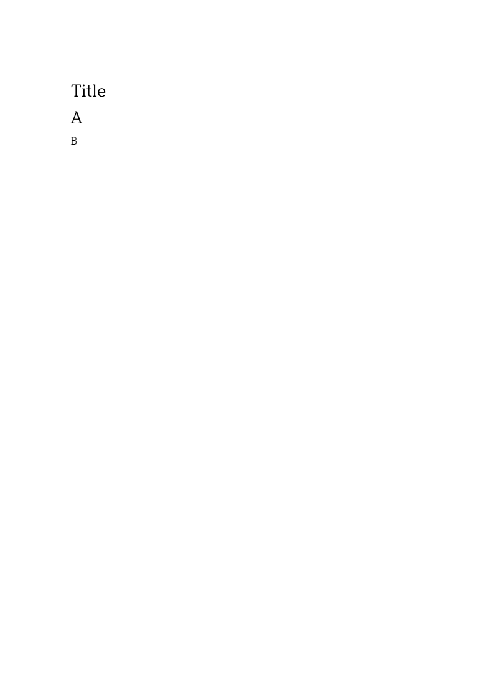
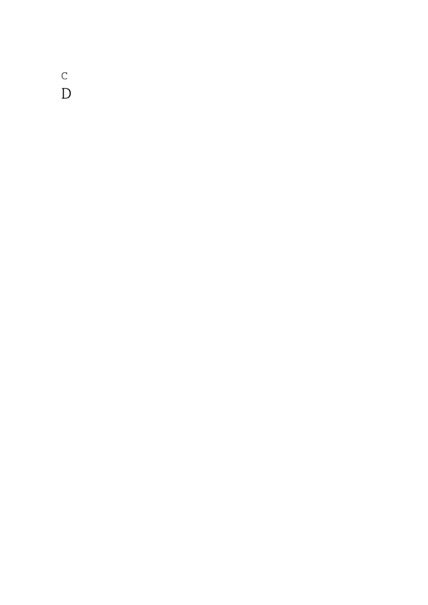
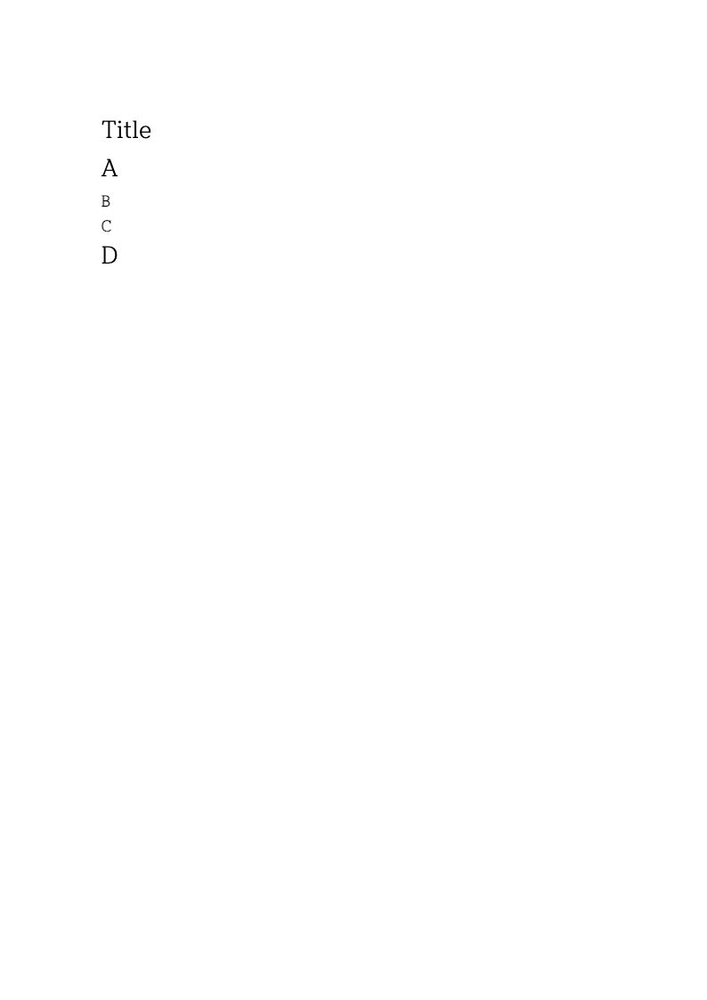
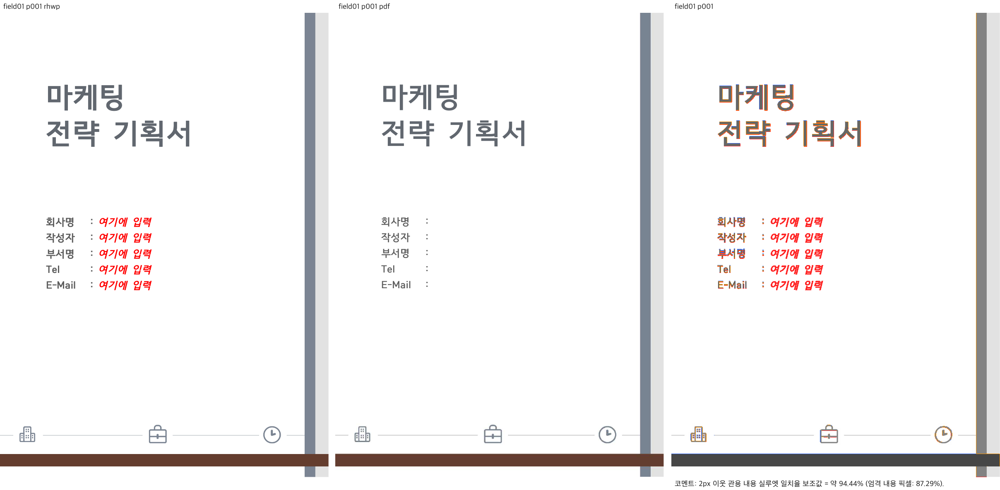
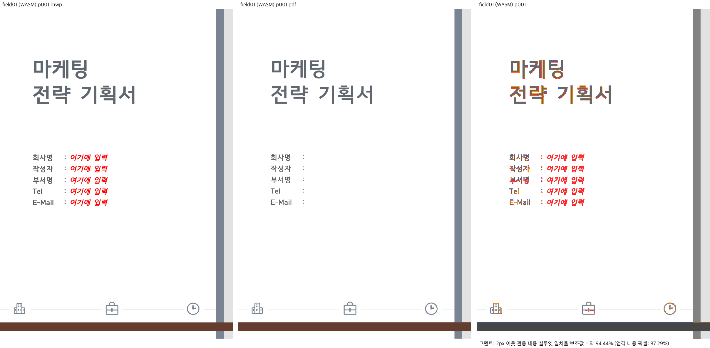
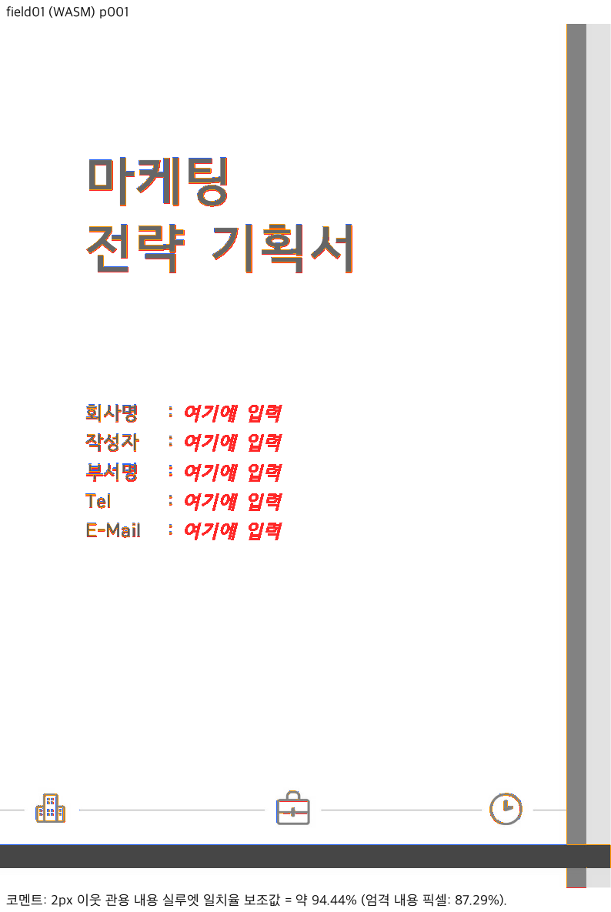
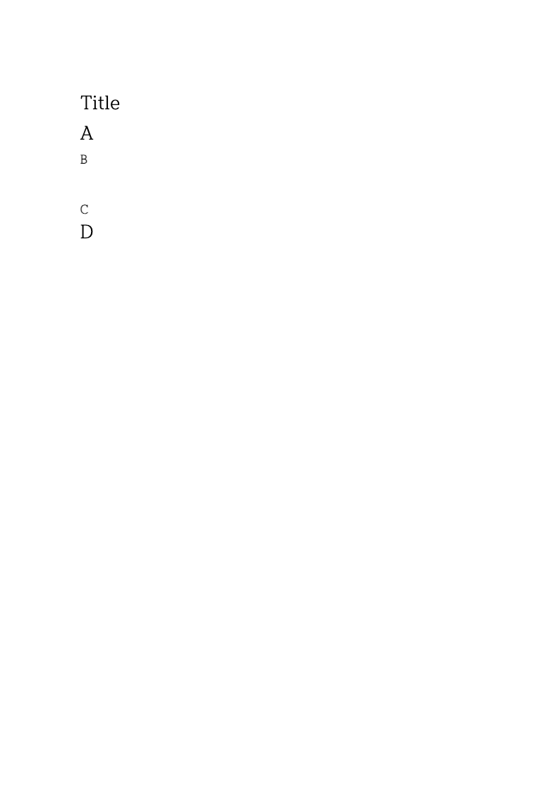

# PR #7468 reviewer 실행 증적 (2026-09-28)

검토 source: `20b388d9c14f8342986fd4277817eb4e843a7822` (`lidge-ai/rhwp`, `fix/pagebreak-after-charshape`).
이 폴더는 reviewer가 직접 수행한 추가 검증의 증적입니다. contributor 코드를 수정하거나 merge한 기록이 아닙니다.
조직 fork에 push할 수 없어 reviewer fork에 증적을 보존하고 PR review에서 commit SHA로 연결합니다.
정식 review 문서의 upstream 통합은 사용자 요청대로 원 PR merge 이후 별도 PR에서 처리합니다.

## 실행 결과와 범위

| 검사 | 결과 | 근거/범위 |
| --- | --- | --- |
| 정확한 head의 focused Rust | 2/2 PASS | [로그](logs/focused.log), `char_shape_after_empty_keeps_page` |
| fresh WASM | 성공 | [빌드 로그](logs/wasm-build.log), release/`--no-opt`, [source·산출물 해시](build-provenance.json) |
| Studio public 동기화 | JS/WASM SHA-256 모두 일치 | wrapper 자동 동기화. Studio 전체 UI 재시험 주장은 아님 |
| field-01 전수 fidelity 원장 | PDF/Native SVG/render tree 모두 3쪽 | [페이지 원장](fidelity/page-count-ledger.tsv), 1–3쪽 텍스트·레이아웃 후보 수집 |
| field-01 1쪽 Native Sweep | 94.43863%, gate `passed` | [요약](native-field01/summary.json), 96 DPI, 2px tolerance |
| field-01 1쪽 fresh WASM Sweep | 94.43863%, gate `passed` | [요약](wasm-field01/summary.json), 실제 Chrome/WASM tree, 전체 export 3쪽 |
| 두 서식 API → 빈 문단 뒤 C → 삭제 | Native/WASM 각 4상태 모두 live/reopen 1쪽 | [Native 좌표](edited/apply-char-format.json), [WASM 결과](edited/wasm-live.json) |
| 최종 줄 bbox | Native/WASM 일치, 줄 겹침 없음 | [검사](edited/geometry-check.json). WASM JSON의 0.1px 반올림 정밀도에서 비교 |
| 실제 저장 경계 앞뒤 편집 | 두 API × 문단 68/69에서 모두 64쪽·경계 vpos=0 유지 | [관측값](edited/stored-boundary.json), 아래 제한 참고 |
| 편집 재현본의 독립 한컴 PDF | 미검증 | 변환 CLI `fetch failed`, 별도 연결 진단 `TimeoutError`: [기록](converter-transport.json) |

### 수정 전 실패 / 수정 후 통과

수정 직전 production source `3f1dbff08`의 세 변경 파일만 검증 worktree에 적용하고, head의 테스트를 그대로 실행했습니다. [음성 대조 로그](logs/focused-before.log): 빈 문단 끝보다 다음 문단이 앞선다는 assertion에서 1 FAIL, 실제 저장 경계 대조군 1 PASS (exit 100). 빌드 오류가 아닌 의도한 assertion 실패입니다. 이후 세 파일을 정확한 head 바이트로 복원하고 [2/2 재통과](logs/focused-restored-head.log)를 확인했습니다. production/test SHA 구분은 [음성 대조 manifest](negative-control.json)를 참조합니다.

같은 [공개 API probe](probe.rs)를 이 음성 대조 라이브러리에도 연결했습니다. `apply-char-format`은 수정 전 live/reopen **2/2쪽**, head **1/1쪽**입니다. C는 physical 2쪽 y=132.2667에서 1쪽 y=288.0으로, D는 2쪽 y=160에서 1쪽 y=315.7333으로 바뀝니다. 빈 문단 삭제 뒤에는 양쪽 모두 1쪽이지만 D의 y는 **458.6667 → 273.0667**입니다. 즉 페이지 수 검사만으로 삭제 후 과도한 간격은 검출하지 못합니다. [수정 전 좌표](before/apply-char-format-delete-empty.json)와 [head 좌표](edited/apply-char-format-delete-empty.json)를 보존했습니다.

`setCharShapeId` 경로의 쪽 수는 수정 전에도 1쪽이므로 그 쪽 수만으로 결함 검출을 주장하지 않습니다. 이 경로의 D y는 330.6667 → 315.7333, 삭제 뒤 288 → 273.0667입니다. 독립 한컴 출력 없이 이 수치만으로 한컴 일치를 확정하지 않습니다.






### 직접 이미지 판독

Native와 WASM의 review 및 standalone overlay를 각각 열어 확인했습니다. 제목, 세로 장식, 하단 수평선과 아이콘 위치가 대응하며 새 줄바꿈·겹침은 관측하지 않았습니다. rhwp에는 빨간 `여기에 입력` 필드 안내가 있고 PDF에는 없습니다. 전체 텍스트 원장도 PDF-only 0, SVG-only 1/2/3쪽 각 25/20/4자를 기록합니다. 무편집 대조군 결과를 편집 재현본의 한컴 정합성 증거로 확장하지 않습니다.






편집 재현본의 Native/WASM 화면에서는 Title/A/B/빈 문단/C/D 순서, 빈 줄 공간, C/D 비겹침과 단일 페이지를 직접 확인했습니다. 아래는 **독립 기준과의 비교가 아닌 실제 실행 화면**입니다.




## 입력과 글꼴

[입력 해시](input-provenance.json)의 네 파일은 모두 source SHA에 실제 포함된 바이트와 일치합니다: `saved/blank2010.hwp`, `samples/field-01.hwp`, `samples/hwp3-sample16-hwp5.hwp`, `pdf/field-01-hwp-2020.pdf`.
기존 PDF는 파일명과 달리 metadata Creator가 Hwp 2022이고 3쪽입니다. 파일명/버전만으로 제외하지 않았습니다.
로컬 Hancom Viewer의 실제 존재하는 `Contents/Resources/Hnc/Shared/TTF/Install`을 확인하고 원본 함초롬돋움 regular/bold를 full embed하여 Native/WASM에 공급했습니다. [font cmap 검사](native-field01/analysis/embedded_font_check.json) 통과, [font supply와 파일 해시](native-field01/run_manifest.json) 참조. 두부/글자 누락은 대표 PNG에서 관측하지 않았습니다. 글꼴 예외는 사용하지 않았습니다. 폰트 파일/임베딩 SVG는 공개 증적에 넣지 않았습니다.

편집 입력은 한컴 원본 `blank2010.hwp`를 읽고 공개 편집 API로 생성했습니다. 저장 LineSeg를 수동 패치하지 않았습니다. [probe.rs](probe.rs)의 생성 절차와 [HWP 출력](edited/apply-char-format.hwp)을 보존합니다. 이 출력은 rhwp 생성본이며 정상 한컴 재저장본으로 분류하지 않습니다.

## 재실행 명령

저장소 root에서 `CARGO_TARGET_DIR`는 공유 `target/pr-review`의 절대 경로를 사용했습니다. Rust 1.93.1, Node 24.15.0, Python 3.12.14 및 Chrome 사용. 정확한 호출·절대경로는 각 로그에 보존했습니다.

```sh
node scripts/rust-test-suite-manifest.mjs --prepare
node scripts/run-rust-test.mjs char_shape_after_empty_keeps_page -- --cargo-profile release-test --target-dir "$CARGO_TARGET_DIR"
CARGO_TARGET_DIR="$CARGO_TARGET_DIR" scripts/wasm-pack-locked.sh --target web --out-dir pkg --no-opt
RHWP_BIN="$CARGO_TARGET_DIR/release-test/rhwp" venv/bin/python tools/fidelity_compare/fidelity_compare.py 0 2 --source samples/field-01.hwp --reference-pdf pdf/field-01-hwp-2020.pdf --label field01 --reference-grade 'repository Hancom PDF' --text-only --export-all-svg --layout-ledger --out-dir output/pr-review/7468-validation/fidelity-field01
venv/bin/python scripts/visual_sweep.py --file-target field01 samples/field-01.hwp pdf/field-01-hwp-2020.pdf --rhwp-bin "$CARGO_TARGET_DIR/release-test/rhwp" --pages 1 --dpi 96 --embed-fonts=full --font-path "$RHWP_FONT_PATH" --out output/pr-review/7468-validation/native-field01
# 같은 명령에 --wasm-pkg pkg 를 추가하고 out을 wasm-field01로 변경
```

진단 스크립트를 `output/pr-review/7468-validation/`에 복사한 뒤 Rust probe는 release-test/deps의 `librhwp.rlib`와 `libserde_json-*.rlib`를 `rustc --edition=2021 --extern`으로 연결하여 실행했습니다. WASM probe는 `node output/pr-review/7468-validation/wasm-probe.mjs`로 실행했습니다. 진단 코드 최초 작성 중의 field 이름/JSON 키 오류는 수정했으며 PR 코드의 실패로 세지 않았습니다.

## 남은 검증과 판정

**머지 보류 유지.** 위 직접 실행으로 이전 review의 로컬 실행 공백은 보완됐습니다. 현재 실행에서 새로운 PR 회귀를 확정하지 않았습니다. 다만 편집 재현 문서 자체의 독립 한컴 출력 비교는 아직 미검증입니다. 변환 서비스가 복구되거나 대응 기준 PDF가 확보되면 저장한 동일 재현 HWP를 기준으로 Native/fresh WASM Sweep을 추가해야 합니다.

저장 경계 진단은 문단 68/69의 첫 글자에 같은 font size/shape ID를 적용해 해당 편집 경로를 실행한 것입니다. 임의 크기 변경·다중 줄 재조판 전체를 검증하지 않았습니다. 각 경우 문단68은 physical 2쪽 y=1020.3733, 문단69는 3쪽 y=75.6267, 문단70은 3쪽 y=129.6533입니다. 전체 tree 생성 중 원거리 문단610의 overflow 경고가 기록됐으며 동일 경고가 수정 전 probe에서도 관측되어 이 PR에서 새로 생긴 경고로 분류하지 않습니다. 원거리 35쪽의 시각 정합성은 검사하지 않았습니다.

Native/WASM 동등성은 독립 기대값을 대신하지 않습니다. API 진단은 정식 `tests/cases/` 회귀를 추가한 것이 아니므로, 두 진입점/실제 저장 경계 편집/저장 재열기 후 좌표를 영속 회귀로 보완하라는 요청은 남습니다. 기존 정확한 head의 전체 CI 성공은 재사용했으며 전체 Rust·세 Clippy·Native Skia를 로컬 재실행했다고 주장하지 않습니다.
