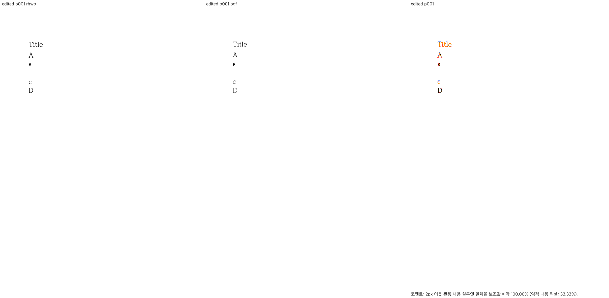
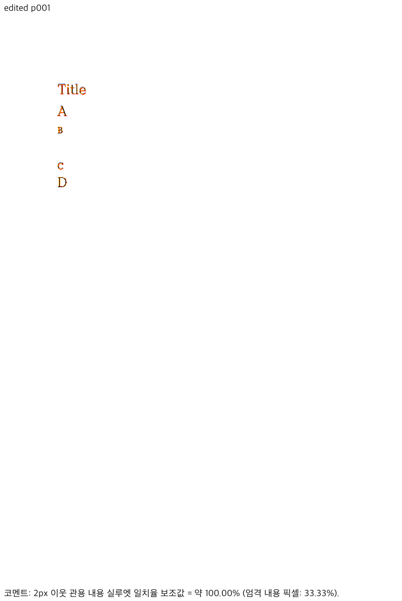
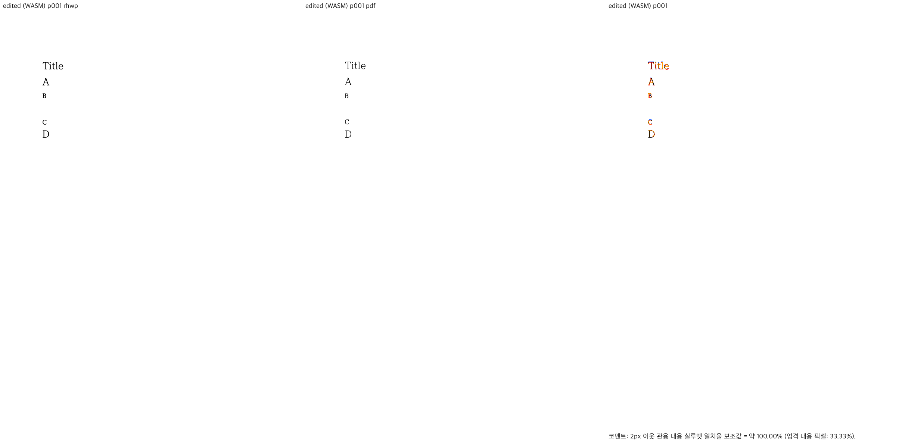
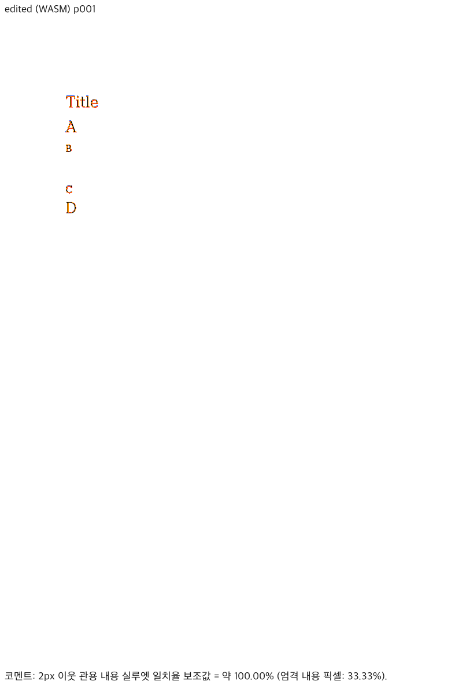
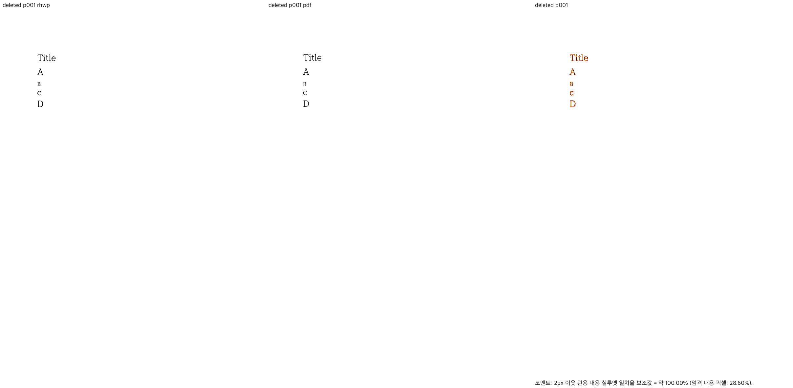
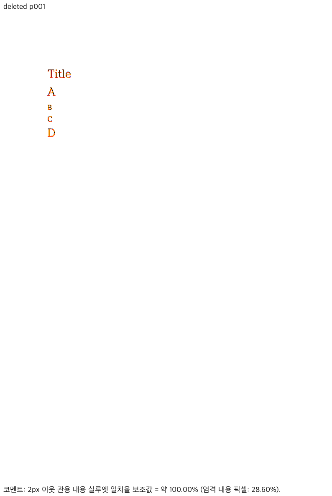
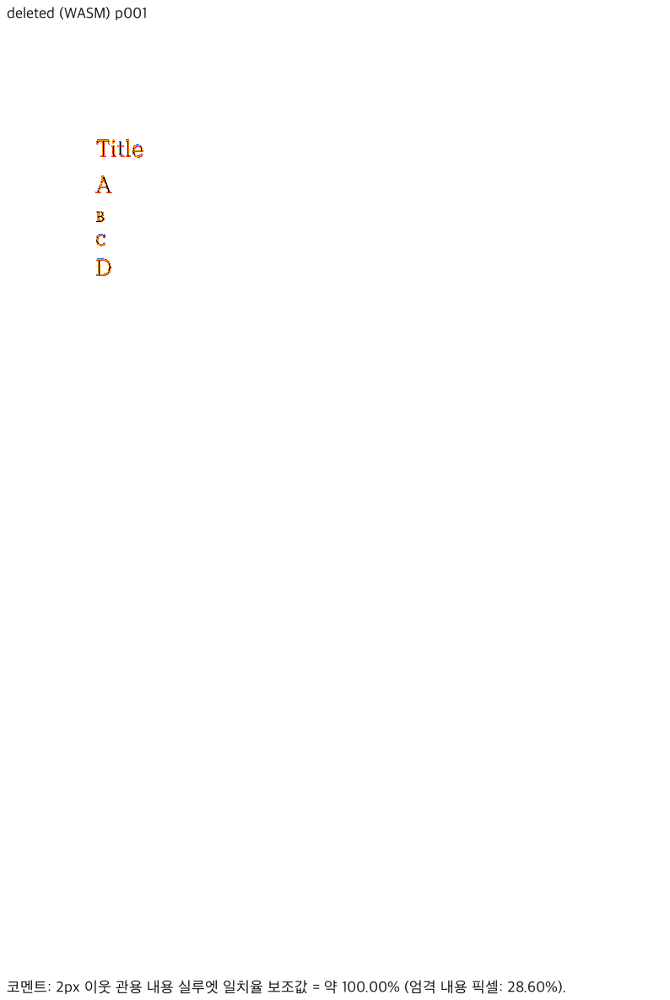

# 한컴 변환 연결 복구 및 편집 재현본 시각 검증

Source SHA: `20b388d9c14f8342986fd4277817eb4e843a7822`. 기존 fresh WASM/Native 바이너리의 SHA-256을 이전 build-provenance와 대조한 뒤 재사용했습니다. production source 변경과 새 Rust 빌드는 없습니다.

## 연결 실패 원인과 조치

기본 환경 파일의 단일 server URL은 현재 네트워크에서 timeout이 나는 내부망 주소였습니다. 같은 설정의 대체 주소와 별도 기존 설정 파일의 주소는 응답했습니다. client 0.9.0의 `clientConfig()`는 `HWP2024_MCP_SERVER_URL`만 읽고 복수형 `HWP2024_MCP_SERVER_URLS`는 사용하지 않습니다. 따라서 대체 주소로 자동 전환되지 않았습니다.

이미 설정되어 있던 응답 가능한 대체 주소로 정상 MCP start를 확인한 후 기본 server URL만 수정했습니다. 인증 정보는 동일함을 확인하고 유지했으며, 원래 설정은 Git 밖에 권한 0600 백업으로 보존했습니다. 수정한 기본 설정으로 status/download 및 두 번째 start/status/download까지 성공했습니다. 서버 자체가 내려갔다고 판정하지 않습니다. 주소·토큰·원본 server 응답은 공개하지 않습니다.

## 독립 기준 PDF

[변환 provenance](conversion-provenance.json)에 입력/출력 SHA-256·bytes·job ID·engine·완료 시각을 보존했습니다. 입력 `lastSavedWith.product`는 `hancom-office-2020`이어서 명시적으로 engine 2020을 사용했습니다. 두 PDF 모두 Creator Hwp 2020, Producer Hancom PDF 1.3.0.550, A4 1쪽입니다. 다운로드 client의 서버 해시 검증에 더해 로컬 SHA-256을 재대조했습니다.

- [편집 직후 PDF](pr7468-apply-char-format-2020.pdf), [입력](../edited/apply-char-format.hwp)
- [빈 문단 삭제 후 PDF](pr7468-delete-empty-2020.pdf), [입력](../edited/apply-char-format-delete-empty.hwp)

`applyCharFormat`과 `setCharShapeId`의 출력 HWP는 편집 직후끼리, 삭제 후끼리 바이트까지 같았습니다. 따라서 상태별 동일 PDF를 두 진입점의 저장 출력에 대응시킬 수 있습니다. [live/reopen geometry](live-reopen-geometry.json)도 Native/WASM의 최종 줄 bbox가 기존 live 편집 좌표와 0.1px 출력 정밀도에서 같음을 확인합니다. 임의 입력 전체의 동등성을 주장하지 않습니다.

| 상태 | Native | fresh WASM | 전체 쪽 수 |
| --- | --- | --- | --- |
| 편집 직후 | 2px 관용 실루엣 100%, passed | 100%, passed | PDF/Native/WASM 모두 1 |
| 빈 문단 삭제 후 | 100%, passed | 100%, passed | PDF/Native/WASM 모두 1 |

96 DPI와 기본 2px tolerance를 그대로 사용했습니다. 글꼴 예외는 없습니다. 한컴 PDF의 HCRBatang/HCRBatang-Bold에 대응하는 로컬 함초롬바탕 regular/bold를 Native/WASM에 공급했습니다. 원 글꼴 파일의 해시·cmap 검사 결과는 각 manifest에 있습니다. 임베딩 SVG·폰트 바이너리는 공개하지 않습니다.

각 Native/WASM review와 standalone overlay를 직접 열어 Title/A/B/C/D, 빈 문단의 공간, 삭제 뒤 C/D 간격을 확인했습니다. 누락·겹침·뜻하지 않은 쪽 분리는 관측하지 않았습니다. **100%는 2px 관용 실루엣 지표이며 픽셀 완전 일치가 아닙니다.** 엄격 잉크 일치율은 편집 직후 33.33333%, 삭제 후 28.60192%이고, 글자 가장자리의 raster 차이는 overlay에 남아 있습니다.










## 명령과 원장

기존 재현 입력을 `start --engine 2020 --output-filename <name>-2020.pdf`, succeeded 확인 뒤 `download`로 변환했습니다. 변환 연결 정보가 담긴 raw 응답 대신 위 whitelist provenance만 게시했습니다.

```sh
# 기존 source SHA에서 빌드했고 해시 대조를 마친 rhwp-head/pkg 사용
RHWP_BIN=output/pr-review/7468-validation/rhwp-head venv/bin/python tools/fidelity_compare/fidelity_compare.py 0 0 --source <edited.hwp> --reference-pdf <hancom.pdf> --label edited --reference-grade 'Hancom MCP engine 2020' --text-only --export-all-svg --layout-ledger --out-dir <fidelity-dir>
venv/bin/python scripts/visual_sweep.py --file-target edited <edited.hwp> <hancom.pdf> --rhwp-bin output/pr-review/7468-validation/rhwp-head --pages 1 --dpi 96 --embed-fonts=full --font-path "$RHWP_FONT_PATH" --out <native-dir>
# 동일 명령에 --wasm-pkg pkg 추가, out 변경. 삭제 후 입력/PDF도 같은 절차.
```

fidelity의 텍스트 차이는 두 상태 모두 PDF-only/SVG-only 0입니다. 현재 `numbered_page_count()`는 `_001.svg` 형태만 세므로 단일 페이지 `apply-char-format.svg`를 0으로 잘못 집계합니다. 원래 원장을 수정하지 않고 보존했으며, 함께 보존한 `export-svg-manifest.json`의 pageCount/renderedCount=1, render tree, PDF, Sweep의 실제 export와 직접 판독을 교차 확인했습니다. 이 집계 이상을 문서 누락으로 분류하지 않습니다.

PDF 증거 부족 요청은 해소됐습니다. 두 편집 진입점·실제 저장 경계 인접 편집·삭제 및 저장 재열기 뒤 최종 좌표를 `tests/cases/`의 영속 회귀로 보완하라는 요청은 유지합니다.
